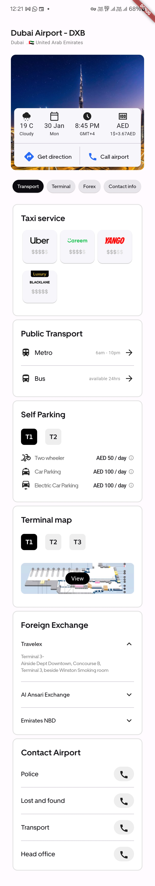
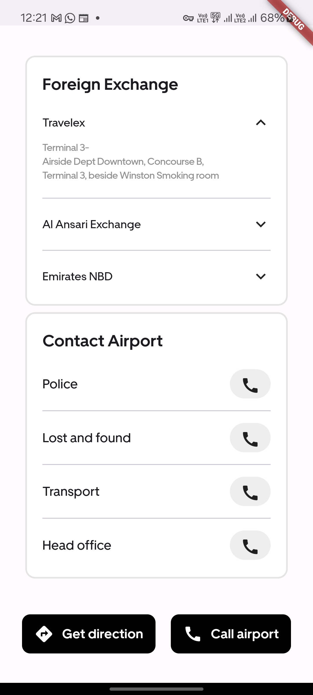

# Airport App

This is a Flutter-based mobile application, designed to enhance the travel experience for passengers using an airport.
This app offers various features to streamline travel processes and improve overall convenience for both passengers and airport staff.
It provides information about user's flight, taxi services, public transport, parking, terminal map, foreign exchange, and contact details. 

> **Note**: This app is static UI design, and does not include any backend functionality yet.

## App Screenshots

## Features

- **Flight Information**: Users can view their flight details, including departure and arrival times, gate number, and flight status.
- **Taxi Services**: Users can book a taxi from the airport to their destination.
- **Public Transport**: Users can view information about public transport services available from the airport.
- **Parking**: Users can view information about parking facilities at the airport.
- **Terminal Map**: Users can view a map of the airport terminal.
- **Foreign Exchange**: Users can view information about foreign exchange services available at the airport.
- **Contact Details**: Users can view contact details for the airport.

## Technologies Used

- **Flutter**: The app is built using the Flutter framework, which allows for cross-platform development.
- **Dart**: The app is written in the Dart programming language, which is used by the Flutter framework.

## APK Download

You can download the APK file for this app from the following link:

[Download](assets\app-release.apk)

